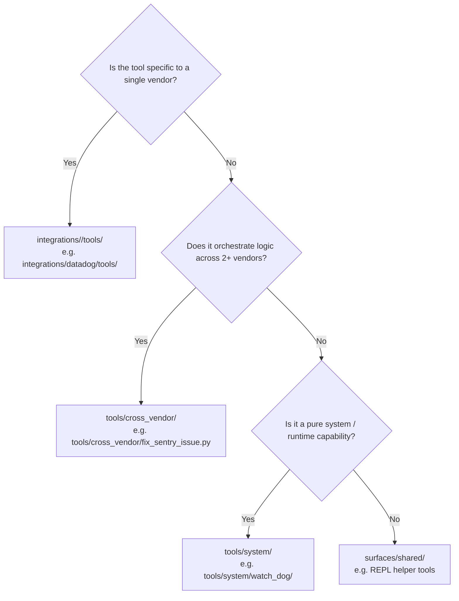

---
aliases:
  - Tool Placement Policy
  - Tool Placement
tags:
  - opensre/architecture
  - opensre/tools
type: note
updated: 2026-07-26
---

# 🛠️ OpenSRE Tool Placement Policy

Where should a new tool live? OpenSRE establishes clear decision rules for locating tool implementations across `integrations/<vendor>/tools/`, `tools/system/`, `tools/cross_vendor/`, or `surfaces/shared/`.

> [!note] Policy Reference
> See [docs/tool-placement-policy.md](file:///Users/amekala/Desktop/opensre/docs/tool-placement-policy.md) for official decision trees.

---

## 🌳 Placement Decision Matrix

---

## 📍 Tool Categories & Paths

### 1. Single-Vendor Tools (`integrations/<vendor>/tools/`)
- **Criteria**: Operates against a single vendor's API client (Datadog query, Sentry issue fetch, Grafana dashboard query, AWS EC2 describe).
- **Location**: `integrations/<vendor>/tools/<tool_name>.py`

### 2. Cross-Vendor Tools (`tools/cross_vendor/`)
- **Criteria**: Combines data or workflows across multiple independent vendor integrations.
- **Example**: `tools/cross_vendor/fix_sentry_issue.py` (reads Sentry error, inspects GitHub repository, executes fix).

### 3. System Tools (`tools/system/`)
- **Criteria**: Vendor-agnostic operational capabilities.
- **Examples**:
  - `tools/system/fleet_monitoring/` — Infrastructure health monitoring.
  - `tools/system/watch_dog/` — Background Telegram alarm dispatch.
  - `tools/system/sre_guidance_tool/` — SRE best practices guidance.

---

## 🔗 Related Notes
- [[Architecture-Overview|Architecture Overview]]
- [[Integrations-Catalog|Integrations Catalog]]
- [[Adding-New-Tools-and-Integrations|Adding New Tools & Integrations Guide]]
