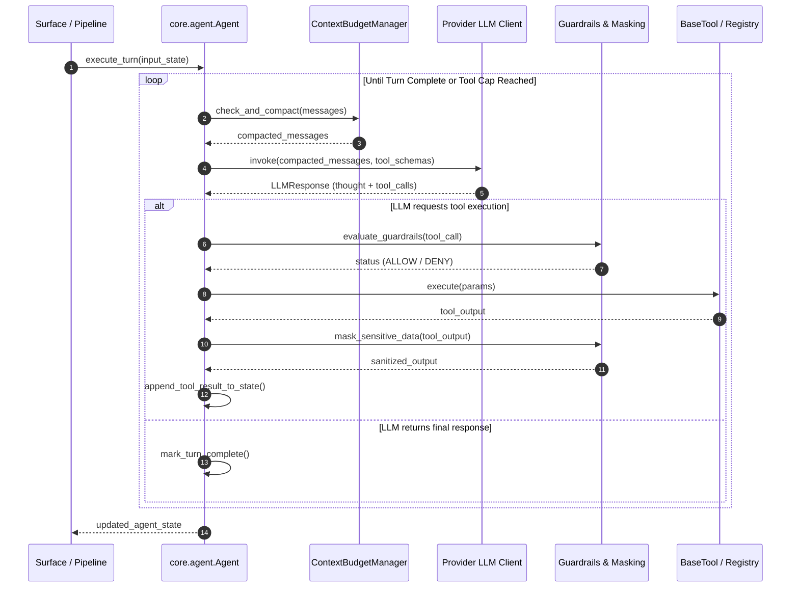

---
aliases:
  - Agent Loop
  - Agent ReAct Loop
  - Think Call Observe Loop
tags:
  - opensre/core
  - opensre/agent
type: note
updated: 2026-07-26
---

# ⚡ Think-Call-Observe Agent Loop

The core execution engine of OpenSRE lives in `core/agent/`. It drives an autonomous **Reasoning & Action (ReAct)** loop that repeatedly prompts the configured LLM provider, executes selected tools, applies safety guardrails, updates state, and manages context token limits.

---

## 🔄 Agent Execution Cycle

---

## ⚙️ Key Agent Components

### 1. Loop Control (`core.agent.Agent`)
- Executes turns in an asynchronous loop (`async run_turn()`).
- Tracks turn counts and prevents infinite looping with stagnation breakers.
- Implements tool cap safeguards (default cap per investigation turn).

### 2. Guardrails & Masking Middleware
- **Guardrails**: Calls `platform/guardrails/` before any tool call is executed. If a tool call violates security policies (e.g. destructive commands without user confirmation), execution is blocked.
- **Masking**: Sanitizes tool execution outputs via `platform/masking/` to redact API keys, tokens, and PII before appending to message history.

---

## 🔗 Related Notes
- [[Context-Budget|Context Budget & Compaction]]
- [[Agent-State|Agent State Architecture]]
- [[Tool-Framework|Tool Framework Primitives]]
- [[Guardrails-Engine|Guardrails Engine]]
