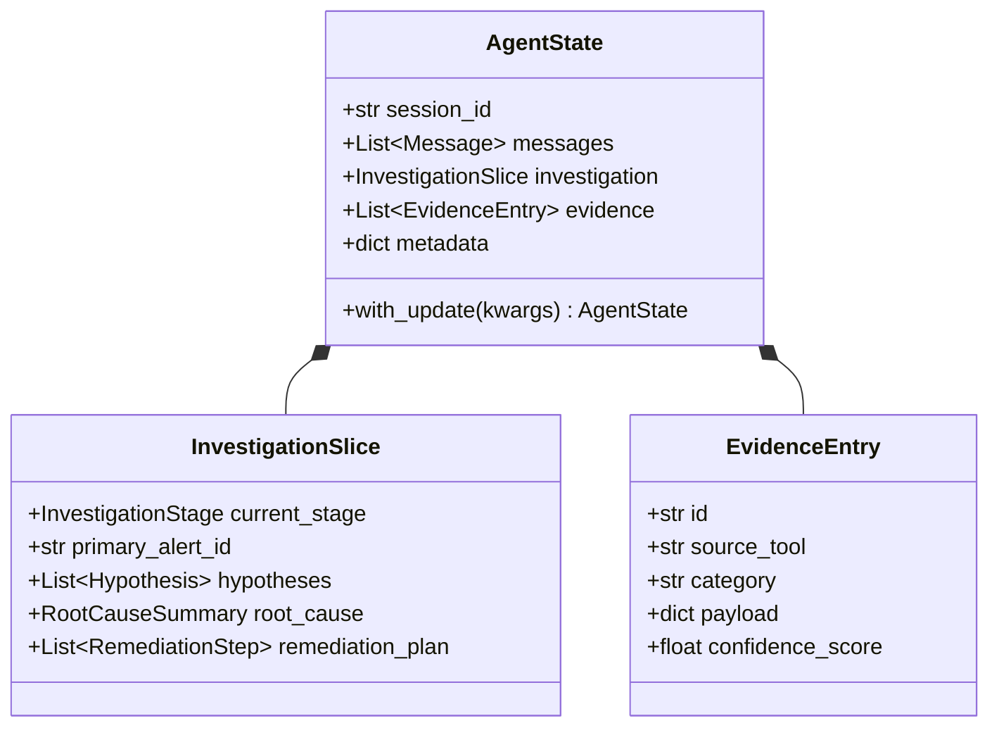

---
aliases:
  - Agent State
  - State Architecture
  - Investigation State
tags:
  - opensre/core
  - opensre/state
type: note
updated: 2026-07-26
---

# 📑 Agent State & Evidence Architecture

State in OpenSRE (`core/state/`) is structured as an immutable, type-safe envelope (`AgentState`) containing message history, execution metadata, and modular domain slices.

---

## 🏗️ State Structure Overview

---

## 🔑 Key Invariants

1. **Immutability**: `AgentState` instances are treated as read-only. Updates construct a new instance via explicit state copy/update methods (`state.with_update(...)`).
2. **Investigation Slice (`InvestigationSlice`)**: Persists stage progression (Triage → Hypothesis → Evidence → RCA → Remediation → Reporting).
3. **Evidence Log (`EvidenceEntry`)**: Stores structured evidence gathered by tools during an investigation, categorized by signal type (logs, metrics, alerts, deploys).

---

## 🔗 Related Notes
- [[Agent-Loop|Agent ReAct Loop]]
- [[Pipeline-Lifecycle|Investigation Pipeline Lifecycle]]
- [[Evidence-Gathering|Evidence & Signal Correlation]]
