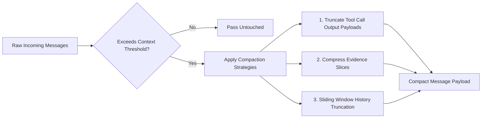

---
aliases:
  - Context Budget
  - Token Compaction
  - Message Budgeting
tags:
  - opensre/core
  - opensre/context
type: note
updated: 2026-07-26
---

# 🧠 Context Budget & Token Compaction

During long-running SRE investigations, raw log outputs, metric series, and trace dumps can rapidly overflow the model's context window. `core/context_budget.py` enforces active token budget rules and performs structured payload compaction.

---

## 🛠️ Budget Management Strategies

1. **Payload Truncation**: Replaces verbose JSON tool responses exceeding `MAX_TOOL_OUTPUT_BYTES` with structured summaries and key fields.
2. **Evidence Compaction**: Compacts duplicate evidence entries into consolidated log snippets.
3. **Sliding Window**: Retains system instructions, active goals, and recent history while pruning older intermediate turns.

> [!important] Performance Rule
> Context calculation uses fast token estimation algorithms without calling expensive `json.dumps()` or `deepcopy()` on the hot path.

---

## 🔗 Related Notes
- [[Agent-Loop|Agent ReAct Loop]]
- [[Agent-State|Agent State & Slices]]
