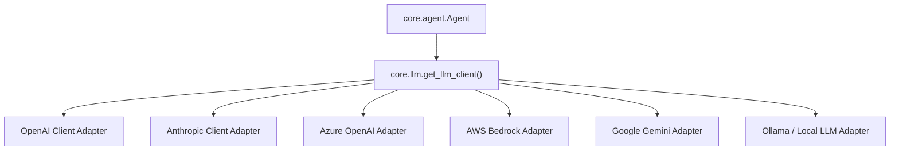

---
aliases:
  - LLM Clients
  - LLM Providers
  - LLM Retry Policy
tags:
  - opensre/core
  - opensre/llm
type: note
updated: 2026-07-26
---

# 🤖 LLM Clients & Provider Adapters

OpenSRE provides unified provider adapters in `core/llm/` supporting OpenAI, Anthropic, Azure OpenAI, AWS Bedrock, Google Gemini, Ollama, and local LLMs.

---

## ⚙️ Provider Architecture

---

## 🔁 Retry & Schema Normalization

1. **Schema Normalization**: Adapts Draft-07 JSON tool schemas to fit provider requirements.
2. **Error Classification (`core/llm_invoke_errors.py`)**: Classifies provider errors into rate limits (`429`), authentication errors (`401`), and server overloads (`5xx`).
3. **Exponential Backoff**: Automatically retries rate-limited API calls with jitter.

---

## 🔗 Related Notes
- [[Agent-Loop|Agent ReAct Loop]]
- [[CLI-Runner|CLI & Provider Setup]]
