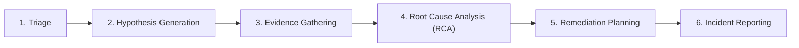

---
aliases:
  - Pipeline Lifecycle
  - Investigation Lifecycle
  - SRE Pipeline
tags:
  - opensre/investigation
  - opensre/pipeline
type: note
updated: 2026-07-26
---

# 🔎 Autonomous Investigation Lifecycle

The investigation pipeline orchestrates end-to-end incident investigation workflows in OpenSRE (`tools/investigation/lifecycle.py`).

> [!architecture] Pipeline Architecture
> See [docs/investigation-pipeline-architecture.md](file:///Users/amekala/Desktop/opensre/docs/investigation-pipeline-architecture.md) for full flow details.

---

## 🌊 6-Stage Investigation Flow

---

## 🎯 Stage Transition Rules

1. Each stage executes as a dedicated agent turn with targeted prompts and restricted tool schemas.
2. Findings from earlier stages persist into `AgentState.investigation` and `AgentState.evidence`.
3. If evidence is inconclusive during RCA, the pipeline can backtrack to **Evidence Gathering** with refined queries.

---

## 🔗 Related Notes
- [[Investigation-Stages|The 6 Investigation Stages Breakdown]]
- [[ReAct-Loop|Investigation ReAct Loop]]
- [[Evidence-Gathering|Evidence & Signal Correlation]]
- [[Reporting|Incident Reporting]]
