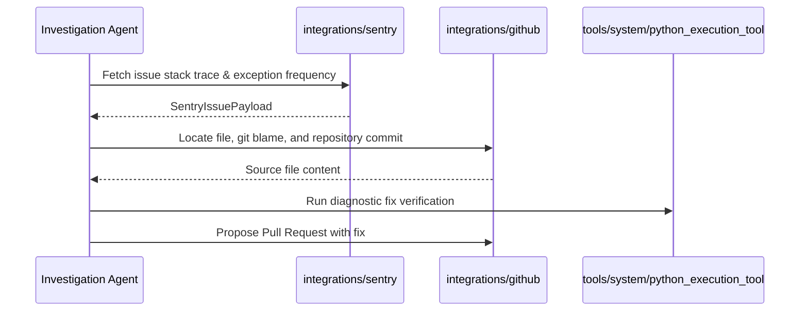

---
aliases:
  - Cross Vendor Tools
  - Multi Vendor Tools
tags:
  - opensre/tools
  - opensre/cross_vendor
type: note
updated: 2026-07-26
---

# 🔀 Cross-Vendor Capability Tools

Cross-vendor tools (`tools/cross_vendor/`) orchestrate complex SRE workflows spanning two or more vendor integrations.

---

## ⚡ Featured Tool: `fix_sentry_issue`

`tools/cross_vendor/fix_sentry_issue.py` automates the remediation workflow for Sentry exceptions:

---

## 🔗 Related Notes
- [[Tool-Placement-Policy|Tool Placement Guidelines]]
- [[Vendor-Integrations|Vendor Integrations]]
- [[System-Tools|System Tools]]
