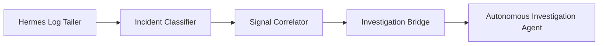

---
aliases:
  - Hermes Log Pipeline
  - Hermes Engine
tags:
  - opensre/integrations
  - opensre/hermes
type: note
updated: 2026-07-26
---

# 🛰️ Hermes Log Tailing & Classification Pipeline

Hermes (`integrations/hermes/`) is OpenSRE's real-time streaming log processor, incident classifier, and investigation correlation engine.

---

## 🏗️ Architecture Flow

1. **Log Tailer**: Streams real-time log lines from Kubernetes, CloudWatch, or local sinks.
2. **Incident Classifier**: Evaluates log anomaly density and classifies incident types (e.g. OOMKilled, DB connection pool leak, 5xx storm).
3. **Investigation Bridge**: Automatically triggers a Stage 1 Triage investigation when log anomalies exceed confidence thresholds.

---

## 🔗 Related Notes
- [[Evidence-Gathering|Evidence & Signal Correlation]]
- [[Pipeline-Lifecycle|Investigation Pipeline Lifecycle]]
