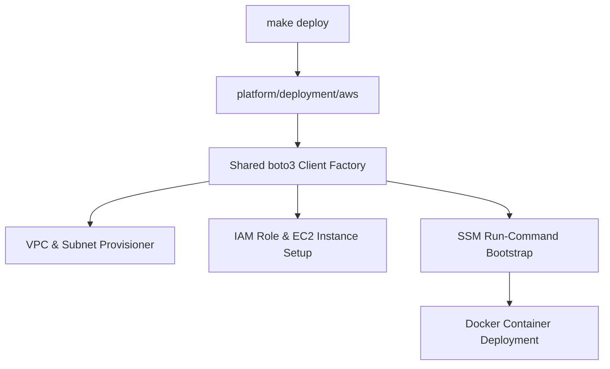

---
aliases:
  - AWS Deployment
  - EC2 Deployment
  - Cloud Deployment
tags:
  - opensre/platform
  - opensre/deployment
type: note
updated: 2026-07-26
---

# ☁️ AWS EC2 & Cloud Deployment

OpenSRE supports single-instance EC2 deployment (`platform/deployment/aws/`) hosting both `opensre-web` (FastAPI health webapp) and `opensre-gateway` (chat daemon).

---

## 🏗️ Architecture & Automation



---

## ⚡ Deployment Commands

```bash
# Deploy opensre to AWS EC2 instance
make deploy

# Destroy deployment resources
make destroy
```

---

## 🔗 Related Notes
- [[Gateway-Architecture|Gateway Daemon Architecture]]
- [[Setup-and-Installation|Setup & Installation]]
