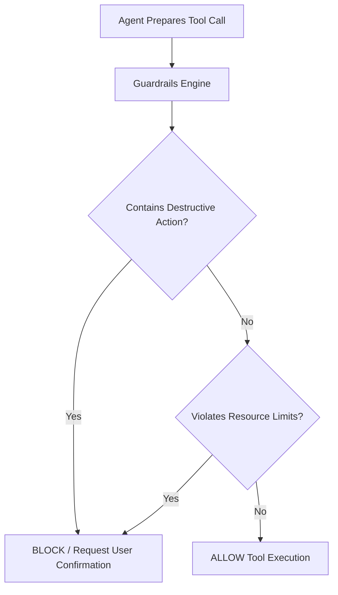

---
aliases:
  - Guardrails Engine
  - Safety Engine
  - Policy Enforcement
tags:
  - opensre/platform
  - opensre/guardrails
type: note
updated: 2026-07-26
---

# 🛡️ Platform Guardrails Engine

The Guardrails engine (`platform/guardrails/`) provides security rules, destructive action verification, and policy enforcement around all agent tool executions.

---

## 🎯 Policy Evaluation Flow

---

## 🔒 Action Rules

- **Destructive Commands**: `rm -rf`, database drops, production pod deletions require user approval or interactive confirmation.
- **Resource Constraints**: Limits max query time windows and restricts write actions during investigation stages.

---

## 🔗 Related Notes
- [[Agent-Loop|Agent ReAct Loop]]
- [[Data-Masking|Data Masking & Redaction]]
- [[Sandbox-Execution|Sandbox Execution]]
