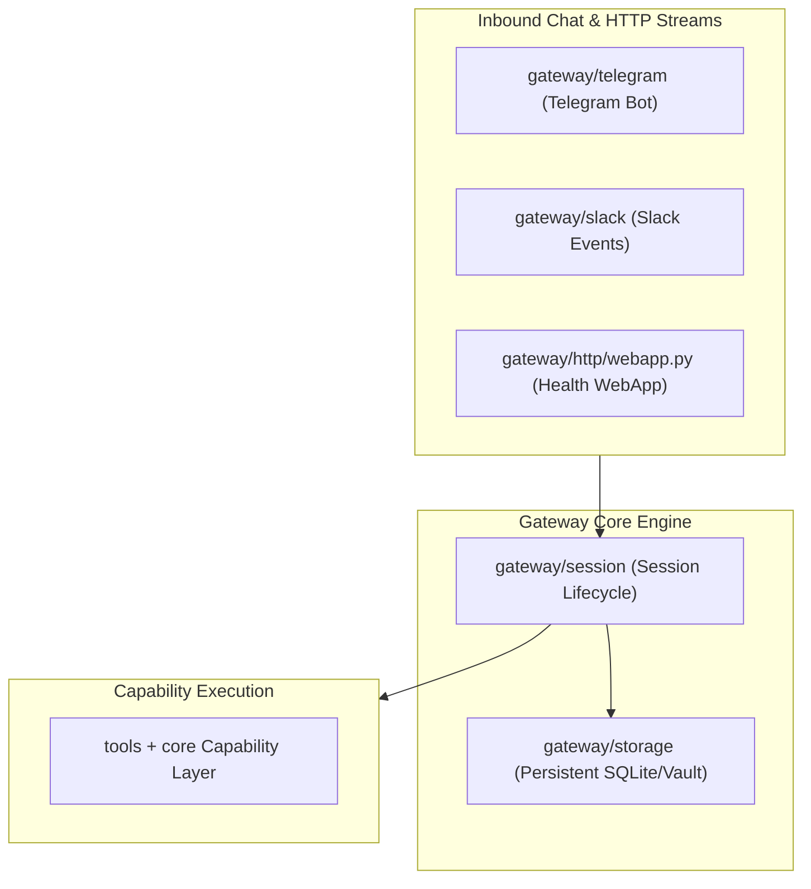

---
aliases:
  - Gateway Architecture
  - Gateway Daemon
  - OpenSRE Gateway
tags:
  - opensre/gateway
type: note
updated: 2026-07-26
---

# 📡 Gateway Daemon Architecture

The `gateway/` package houses the long-running daemon that listens for continuous inbound chat events from Slack, Telegram, and webhooks.

---

## 🏗️ Gateway Structure

---

## 🔑 Key Responsibilities

1. **Independent Tier-1 Peer**: Serves as a peer to `surfaces/`. Never imports `surfaces/`.
2. **Health WebApp (`gateway/http/webapp.py`)**: FastAPI health check server running on container deployment.
3. **Session Persistence**: Maintains conversation history and active investigation context per chat channel.

---

## 🔗 Related Notes
- [[Telegram-and-Slack-Sinks|Telegram & Slack Output Sinks]]
- [[Session-and-Storage|Session State & Vault Storage]]
- [[Layer-Stack|Layer Stack Architecture]]
