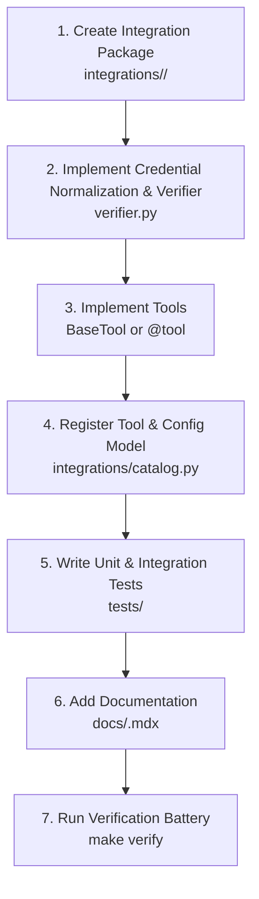

---
aliases:
  - Adding New Tools and Integrations
  - Adding Integrations
  - Definition of Done
tags:
  - opensre/ops
  - opensre/contributing
type: note
updated: 2026-07-26
---

# 🚀 Guide: Adding Tools & Vendor Integrations

Follow this step-by-step definition of done when adding a new tool or integration to OpenSRE.

> [!note] Policy Reference
> See [docs/adding-tools-and-integrations.md](file:///Users/amekala/Desktop/opensre/docs/adding-tools-and-integrations.md).

---

## 📝 Step-by-Step Workflow

---

## 🎯 Definition of Done Checklist

- [ ] `integrations/<vendor>/client.py` implements clean API interaction.
- [ ] `integrations/<vendor>/verifier.py` provides health check.
- [ ] Tool placement complies with [[Tool-Placement-Policy|Tool Placement Policy]].
- [ ] Draft-07 JSON schemas are validated.
- [ ] `make verify` and `make check-imports` pass cleanly.

---

## 🔗 Related Notes
- [[Tool-Placement-Policy|Tool Placement Policy]]
- [[Vendor-Integrations|Vendor Integration Architecture]]
- [[CI-CD-and-Testing|CI/CD Parity & Testing]]
