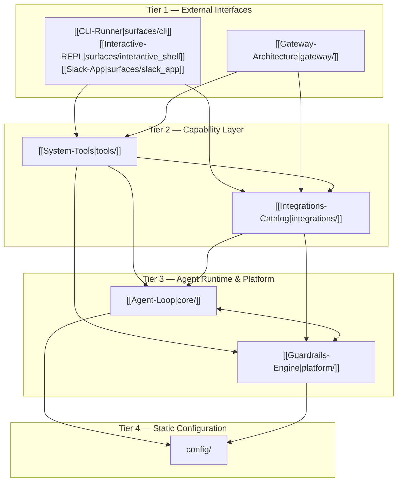

---
aliases:
  - Architecture Overview
  - OpenSRE Architecture
  - Architecture Blueprint
tags:
  - opensre/architecture
  - opensre/overview
type: architecture
updated: 2026-07-26
---

# 🏛️ OpenSRE Architecture Blueprint

The **OpenSRE** codebase follows a strict **four-tiered architectural model**. This structure guarantees clean separation of concerns, prevents cyclic dependencies, and ensures that user-facing surfaces can be added or refactored without breaking underlying agent execution logic.

> [!architecture] Architectural Invariant
> **Dependencies point downward only.** Higher tiers may import lower tiers; lower tiers must never import higher tiers. Compliance is enforced automatically in CI via `make check-imports` using `import-linter`.

---

## 📊 The Four-Tier Stack

| Tier | Packages | May Import | Must Never Import | Peer Import Rule |
| :--- | :--- | :--- | :--- | :--- |
| **Tier 1 (Top)** | `surfaces`, `gateway` | `tools`, `integrations`, `core`, `platform`, `config` | — | Independent: must **not** import each other |
| **Tier 2** | `tools` | `integrations`, `core`, `platform`, `config` | `surfaces`, `gateway` | May import `integrations` |
| **Tier 2** | `integrations` | `core`, `platform`, `config` | `tools`, `surfaces`, `gateway` | Must **never** import `tools` |
| **Tier 3** | `core`, `platform` | `config` | `surfaces`, `gateway`, `tools`, `integrations` | Siblings: **may** cross-import each other |
| **Tier 4 (Bottom)**| `config` | — *(None)* | All upper packages | Independent leaf package |

---

## 🔄 Dependency Flow Diagram

---

## 🔍 Key Tier Responsibilities

### Tier 1 — Surfaces (`surfaces/`) & Gateway (`gateway/`)
- **`surfaces/`**: Contains user interfaces (CLI, REPL interactive terminal, Slack app bot). Each surface owns its I/O loop, terminal formatting, and slash command handling.
- **`gateway/`**: Asynchronous messaging gateway for continuous incident monitoring across chat channels (Slack/Telegram).
- **Rule**: `surfaces` and `gateway` are peers. They never import from each other.

### Tier 2 — Tools (`tools/`) & Integrations (`integrations/`)
- **`integrations/`**: Normalizes user credentials, executes health verification (`verifier.py`), and exposes API clients for external services (Datadog, AWS, Grafana, etc.).
- **`tools/`**: Implements agent-callable tools (`BaseTool` and `@tool` decorated functions). Also contains the composite **Investigation Lifecycle** (`tools/investigation/`).
- **Rule**: `integrations` can be used directly without bringing in the agent layer (`tools`). Thus, `tools` may import `integrations`, but `integrations` **never** imports `tools`.

### Tier 3 — Core (`core/`) & Platform (`platform/`)
- **`core/`**: Provider-agnostic agent execution loop (`core.agent.Agent`), state slices (`core/state`), context budget management (`core/context_budget.py`), and tool framework primitives (`core/tool_framework`).
- **`platform/`**: Cross-cutting infrastructure services: [[Guardrails-Engine|Guardrails]], [[Data-Masking|Masking]], [[Sandbox-Execution|Sandbox]], Observability, and AWS deployment.
- **Rule**: `core` and `platform` are sibling packages. They are permitted to cross-import (e.g. `core` uses `platform` guardrails and masking, while `platform` references `core` state models).

### Tier 4 — Config (`config/`)
- Contains static constants, environment variable parsing, UI themes, and prompt definitions.
- **Rule**: `config` imports no first-party code. It is an absolute leaf node in the import graph.

---

## 🎯 Cross-Layer Execution Examples

### 1. CLI Investigation Flow
1. User invokes `opensre investigate --alert alert-123` via [[CLI-Runner|surfaces/cli]].
2. `surfaces/cli` delegates to the investigation lifecycle manager in [[Pipeline-Lifecycle|tools/investigation/lifecycle.py]].
3. The pipeline creates an [[Agent-Loop|Agent]] from `core` to run the 6-stage investigation loop.
4. Investigation tools call [[Vendor-Integrations|integrations]] to fetch metrics, logs, and traces from Datadog/Grafana.
5. [[Guardrails-Engine|Guardrails]] and [[Data-Masking|Masking]] validate tool inputs and sanitize output payloads before writing to [[Agent-State|AgentState]].

### 2. Gateway Message Processing
1. Inbound message received via [[Gateway-Architecture|gateway/telegram]] or `gateway/slack`.
2. Session state resolved from `gateway/storage`.
3. Gateway invokes standard `tools` and `core` pipelines directly without passing through `surfaces/`.

---

## 🔗 Related Notes
- [[Layer-Stack|Layer Stack Detail]]
- [[Dependency-Rules|Dependency Invariants & Import Linter]]
- [[Naming-Conventions|Domain Naming & Glossary]]
- [[Tool-Placement-Policy|Tool Placement Guidelines]]
