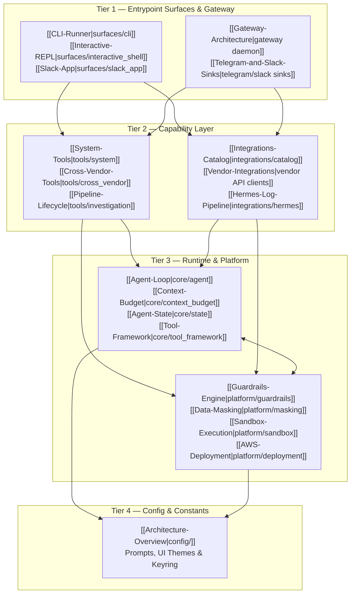

---
aliases:
  - Home
  - OpenSRE Wiki
  - Map of Content
  - MOC
tags:
  - opensre/moc
  - opensre/hub
type: moc
updated: 2026-07-26
---

# 🚀 OpenSRE Knowledge Vault & Engineering Wiki

Welcome to the **OpenSRE Obsidian Vault** — the authoritative architectural, technical, operational, and development documentation for **OpenSRE**, the open-source autonomous SRE agent framework and incident investigation engine.

> [!abstract] What is OpenSRE?
> **OpenSRE** is an enterprise-grade autonomous Site Reliability Engineering (SRE) platform. It provides a multi-agent ReAct investigation pipeline, automated observability integration, root-cause analysis, and remediation capabilities across CLI, interactive REPL, Slack, and gateway surfaces.

---

## 🏛️ Architecture Map of Content

---

## 📚 Vault Navigation Hubs

### 1. [[Architecture-Overview|🏛️ Architecture & Governance]]
- [[Layer-Stack|Layer Stack (Tiers 1–4)]] — Tiered package architecture and dependency rules
- [[Dependency-Rules|Dependency Invariants]] — CI import checking with `make check-imports`
- [[Naming-Conventions|Naming Conventions]] — Glossary (`AgentState`, `RunInput`, `RunResult`) and `{domain}_{role}.py`
- [[Tool-Placement-Policy|Tool Placement Policy]] — Rules for vendor vs system vs cross-vendor tool placement

### 2. [[Agent-Loop|⚡ Core Agent Runtime]]
- [[Agent-Loop|Think-Call-Observe Agent Loop]] — Core `core.agent.Agent` execution cycle
- [[Context-Budget|Context Budget & Compaction]] — Token tracking, payload truncation, sliding window
- [[Agent-State|Agent State & Evidence]] — Immutable state models, evidence entries, and pipeline slices
- [[Tool-Framework|Tool Framework & Primitives]] — `BaseTool`, `@tool` decorator, and tool error handling
- [[LLM-Clients-and-Retry|LLM Clients & Retry Engine]] — Hosted provider adapters, schema normalization, backoff

### 3. [[Pipeline-Lifecycle|🔎 Investigation Engine]]
- [[Pipeline-Lifecycle|Investigation Lifecycle]] — 6-stage autonomous investigation orchestration
- [[Investigation-Stages|The 6 Investigation Stages]] — Triage, Hypothesis, Evidence, RCA, Remediation, Reporting
- [[ReAct-Loop|Investigation ReAct Loop]] — Stagnation breakers, tool invocation caps, context safety
- [[Evidence-Gathering|Evidence & Signal Correlation]] — Metric windows, log tailing, alert correlation
- [[Reporting|Incident Reporting]] — Markdown reports, JSON output, and Slack/Telegram delivery

### 4. [[CLI-Runner|💻 User Surfaces & Gateway]]
- [[CLI-Runner|CLI Runner & Onboarding]] — `opensre` CLI commands and setup wizard
- [[Interactive-REPL|Interactive REPL]] — Terminal UI, interactive shell, slash commands
- [[REPL-Watchdog|REPL Watchdog Commands]] — `/watch`, `/watches`, and `/unwatch` background monitoring
- [[Action-Planner-Policy|Action Planner & Turn Policy]] — Turn planning harness and no fail-closed policy
- [[Slack-App|Slack Application Surface]] — Interactive Slack app integration

### 5. [[Integrations-Catalog|🔌 Integrations & Tools]]
- [[Integrations-Catalog|Integrations Catalog]] — Supported platforms (Datadog, Grafana, AWS, K8s, PagerDuty, etc.)
- [[Vendor-Integrations|Vendor Integration Architecture]] — Config normalization, verifiers, and API clients
- [[System-Tools|System & Operational Tools]] — Fleet monitoring, watchdog alarms, Python executor
- [[Cross-Vendor-Tools|Cross-Vendor Capability Tools]] — Multi-platform workflows (e.g. `fix_sentry_issue`)
- [[Hermes-Log-Pipeline|Hermes Log Pipeline]] — Real-time log tailing, incident classification, and correlation

### 6. [[Guardrails-Engine|🛡️ Platform Services]]
- [[Guardrails-Engine|Guardrails Engine]] — Action policy rules, destructive command safety checks
- [[Data-Masking|Data Masking & Redaction]] — Secret, credential, and PII masking pipeline
- [[Sandbox-Execution|Sandbox Execution]] — Controlled execution environment for shell actions
- [[Observability-and-Analytics|Observability & Analytics]] — Harness ports, event tracking, and metrics
- [[AWS-Deployment|AWS & Cloud Infrastructure]] — Single-instance EC2 deployment (`opensre-web` & `gateway`)

### 7. [[Gateway-Architecture|📡 Gateway Daemon]]
- [[Gateway-Architecture|Gateway Daemon Architecture]] — Background chat daemon, FastAPI health app
- [[Telegram-and-Slack-Sinks|Telegram & Slack Sinks]] — Inbound event routing and error redaction boundaries
- [[Session-and-Storage|Session & Vault Storage]] — In-memory session tracking, encrypted vault storage

### 8. [[Setup-and-Installation|🛠️ Developer & Operational Guide]]
- [[Setup-and-Installation|Setup & Environment Installation]] — Local environment setup with `uv` and `make install`
- [[CI-CD-and-Testing|CI/CD Parity & Quality Assurance]] — Mandatory `CI.md` pre-push checklist
- [[Adding-New-Tools-and-Integrations|Adding Tools & Integrations]] — Step-by-step contribution guide and Definition of Done
- [[Troubleshooting-and-FAQ|Troubleshooting & Footgun Guide]] — Known pitfalls (CWE-209, cyclic imports, JSON Schema rules)

---

## 🏷️ Tag Directory

- `#opensre/architecture` — Package boundaries, layer stack rules, dependency graph
- `#opensre/core` — Agent loop, context budget, state, tool framework
- `#opensre/investigation` — Investigation lifecycle, ReAct engine, evidence, RCA
- `#opensre/surfaces` — CLI, REPL, Slack bot, gateway daemon
- `#opensre/integrations` — Datadog, Grafana, AWS, Kubernetes, Sentry, PagerDuty
- `#opensre/tools` — Capability tools, system tools, cross-vendor tools
- `#opensre/platform` — Guardrails, masking, sandbox, analytics, deployment
- `#opensre/ops` — CI/CD, setup, testing, troubleshooting

---

> [!tip] Navigating in Obsidian
> Use `Cmd + O` / `Ctrl + O` to quickly search for notes, or press `Cmd + G` / `Ctrl + G` to view the interactive visual graph of the OpenSRE vault!
